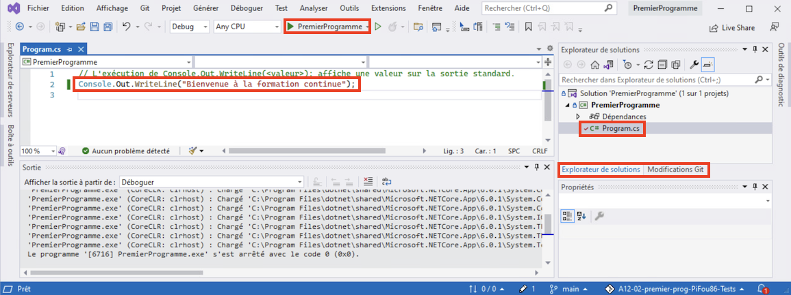
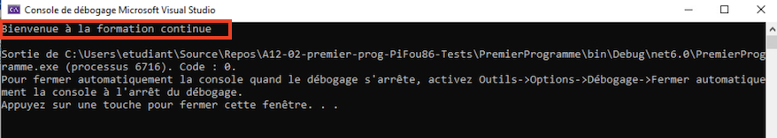
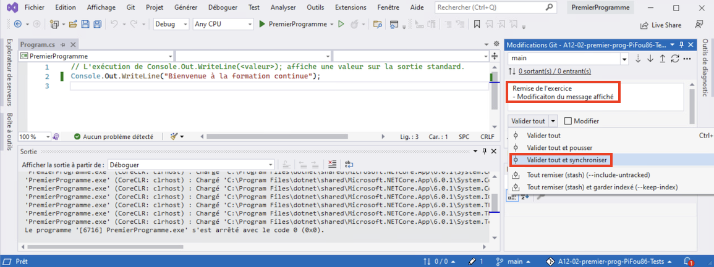
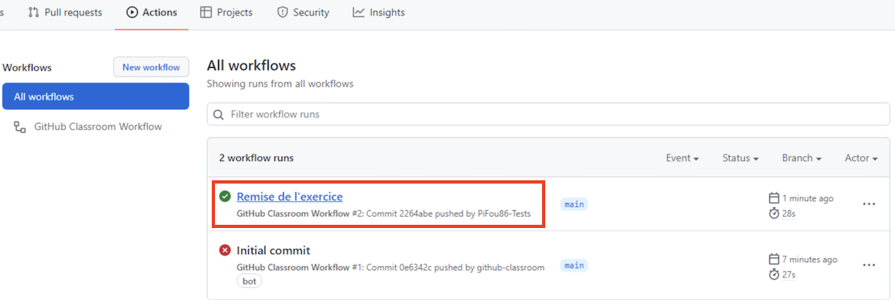
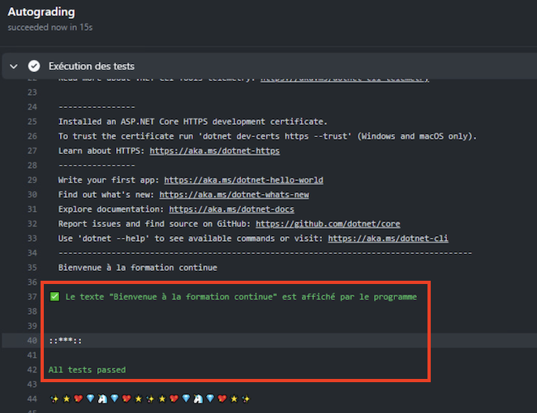

# Votre premier programme CSharp

## Exercice 1 - Modification du programme

- Ouvrez la solution CSharp "PremierProgramme.sln"
- Dans cette solution, ouvrez le projet "PremierProgramme" et ouvrez le fichier "Program.cs"
- Modifiez le programme pour qu'il affiche "Bienvenue à la formation continue" :
  - Placez-vous sur la ligne ```Console.Out.WriteLine();```
  - Modifiez cette ligne pour ajouter le texte "Bienvenue à la formation continue" dans la parenthèse
- Essayez votre programme en cliquant sur le bouton "PremierProgramme" qui se trouve dans la barre de menu. Il est précédé par un triangle vert



- Si la modification est correcte, le programme affichera "Bienvenue à la formation continue"



- Si vous avez une erreur, validez que le programme est correct :
  - Le texte à afficher doit être placé dans les parenthèses
  - Ce texte doit être encadré par des guillemets
  - Si vous ne trouvez pas l'erreur, demandez de l'aide !
- Utilisez la même procédure que dans l'exercice précédent pour "Valider tout et synchroniser" votre code.



- Si tout s'est bien passé, rendez-vous sur le site GitHub pour valider votre travail dans l'onglet "Actions" (Voir exercice précédent)





**Vous voilà à la fin du laboratoire 12 ! Félicitations, vous avez surmonté beaucoup de potentiels défis pour arriver ici !**

[Retour à la page principale](README.md)
